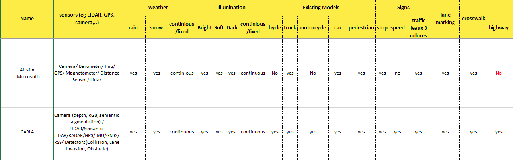

# Virtual Open-source Self-driving Car Simulators

This repository aims to list 13 open-source virtual self-driving car simulators and provide a detailed comparison between them available in the excel sheet provided.

We propose a taxonomy which includes a diverse and imporant set of features that we think should be supported by a simulator. For example, We look into the details of the various weather conditions supported, type of sensors supported, diversity of existing maps,  etc. The taxanomy is used to extract specific features about a simulator and fill the excel sheet provided.

Finally, we perform a ranking over the simulators. The ranking takes into account the maturity, web presnece, platform support, programming langauge support, Github presence, and research influence of a simulator etc. We Conclude that Airsim, Carla and Gazebo are highly ranked in our list.

Hope this comparison and ranking can help you make a better descision with regards to your choice of simulator in your upcoming project. A sample of the excel sheet is shown below.

The list of 13 open-source virtual self-driving simulators included in this comparison:
 - Airsim
 - CARLA
 - GAZEBO
 - Racer
 - Speed Dreams
 - Sumo
 - Torcs
 - Vdrift
 - Baidu Apollo
 - Udacity Self-Driving Car Simulator
 - DeepDrive simulator
 - openDs
 - lgsvl simulator

# Taxonomy
The major taxonomy used to classify simulators is presented below. You will notice that we also extracted other info for each simulator that is not present in the taxonomy here, this info is used to help with the ranking scheme used.

    - Weather Condition (rain, snow, continous/fixed)
    - Sensors (LIDAR, CAMERA etc.)
    - Illumination (bright, soft, dark, continous/fixed)
    - Existing Models (bycle, truck, motorcycle, car, pedestrian)
    - Traffic Signs (Stop, Speed, TRaffic light)
    - Maps (Highway, intersection, roundabout)
    - Count of ready existing maps
    - platform support (Linux, windows, Mac os, OpenSolaris, FreeBSD, Ubuntu)
    - programming langauges supported (Python, Java, C, C++, C#)

# Ranking
We came up with a ranking formula that takes into consideration 8 properties for a simulator, namely:
- **Maturity** The age of the simulator (Since its first release) is taken as an idication of maturity. This score relies on the idea that the more mature a simulator the more features it supports. This score is positively correlated with the ranking.
- **Release Frequency Per Year** This counts the average number of full releases per year. This gives an indication of the activity of developers behind the simulator. Ofcourse, new releases mean bug fixes and more features. Therefore, this score is also positively correlated with the ranking.  
- **Years of inactivity** The count of years since the last release. Ofcourse this score negatively affects the simulators final rank, the higher it is the lower the simulator's rank.
- **Webranking** The global internet traffic and engagement as extracted from Alex.com.
- **Platform support**	This measure the total count of platfoms supported by the simulator. The higher, the better, as this implies it has a wider audience and coverage.
- **Programming langauge support**	This measure the total count of programming languages supported by the simulator. The higher, the better, as this implies it has a wider audience and coverage.
- **GTHUB score** Is a function that takes into consideration the various values extracted from the official github repository of the simulator. The functions uses the total number of watches, Stars, Forsk, pulls, Open Issues, and Closed issues. This score is positively correlated with the simulator's rank 
- **Pesearch influence score** This score is the citation count as of date for the main publication presenting the simulator to the research community. The citation count is taken as an impact factor of this simulator on the ereasearch community. This score is positively related to the simulator's rank.

All the information presented above is beautifully presented in the file simulator_survey.xlsx

